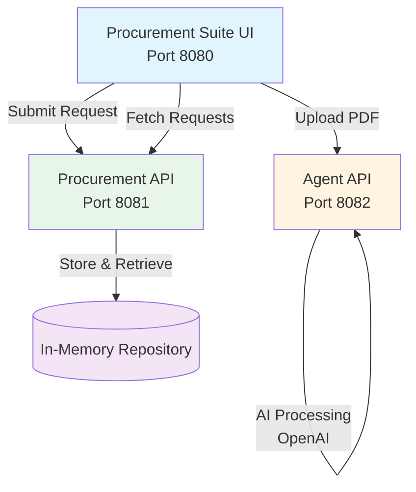
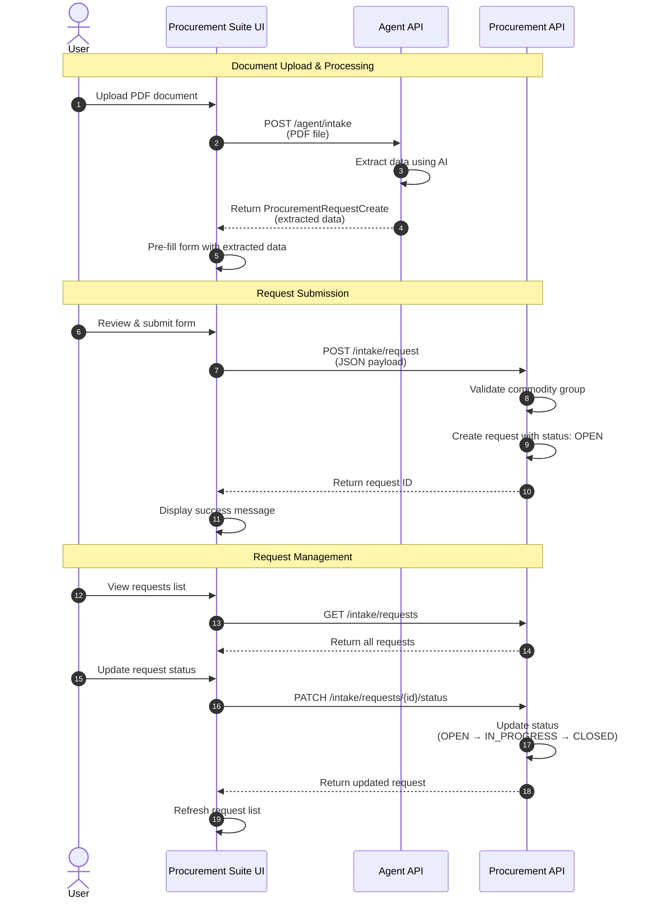

# Procurement Suite

A comprehensive procurement management system with AI-powered document intake, API services, and a modern web interface.

## Installation

### Prerequisites
- Docker and Docker Compose
- OpenAI API Key

### Setup Steps

1. **Configure environment variables**

   Copy all `.env.template` files from the individual apps to `.env`:
   ```bash
   cp apps/agent/.env.template apps/agent/.env
   cp apps/api/.env.template apps/api/.env
   cp apps/ui/.env.template apps/ui/.env
   ```

2. **Set OpenAI API Key**

   Edit `apps/agent/.env` and set your OpenAI API key:
   ```bash
   OPENAI_API_KEY=your_api_key_here
   ```

3. **Build and run the application**

   ```bash
   docker-compose up --build
   ```

4. **Access the application**

   - UI: http://localhost:8080
   - Procurement API: http://localhost:8081
   - Intake Agent API: http://localhost:8082

## Architecture

### System Components



### HTTP Request Flow



### Key Endpoints

#### Agent API (Port 8082)
- `POST /agent/intake` - Process PDF document using Intake Agent to extract procurement data

#### Procurement API (Port 8081)
- `POST /intake/request` - Create new procurement request
- `GET /intake/requests` - Get all procurement requests
- `GET /intake/requests/{id}` - Get request by ID
- `PATCH /intake/requests/{id}/status` - Update request status
- `GET /intake/commodity_groups` - Get available commodity groups

### Technology Stack

- **Frontend**: React + TypeScript + Material-UI + Vite
- **Backend APIs**: FastAPI + Python
- **AI/ML**: OpenAI API (document processing)
- **Containerization**: Docker + Docker Compose
- **PDF Processing**: react-pdf (frontend), AI extraction (backend)

## Development

### Project Structure

```
procurement-suite/
├── apps/
│   ├── agent/          # AI-powered intake agent service
│   ├── api/            # Procurement management API
│   └── ui/             # React frontend application
├── docker-compose.yaml # Multi-container orchestration
└── README.md
```

### Data Flow

1. **Document Upload**: User uploads PDF → UI sends to Agent API
2. **AI Extraction**: Agent API processes PDF using OpenAI → Returns structured data
3. **Form Pre-fill**: UI populates form fields with extracted data
4. **Request Creation**: User submits → UI sends to Procurement API → Stored with status OPEN
5. **Status Updates**: Requests can be updated through workflow: OPEN → IN_PROCESS → CLOSED 
